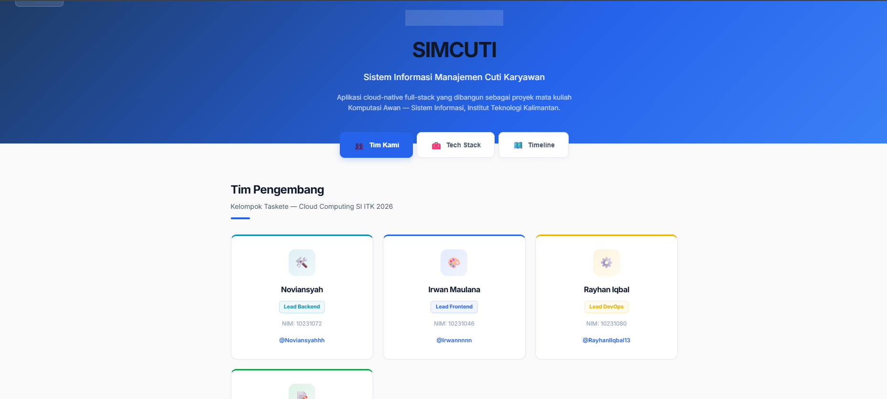
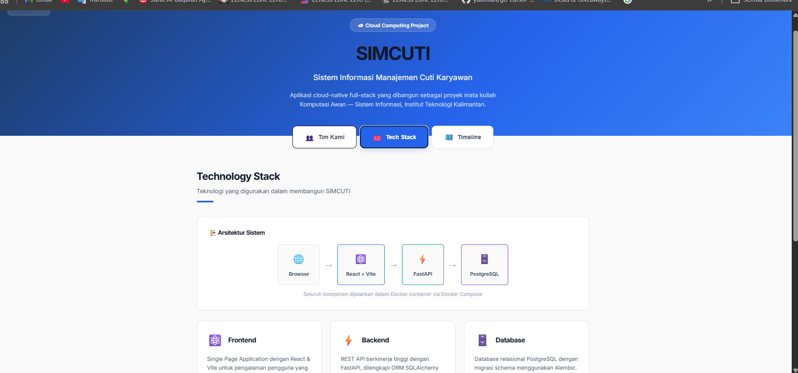
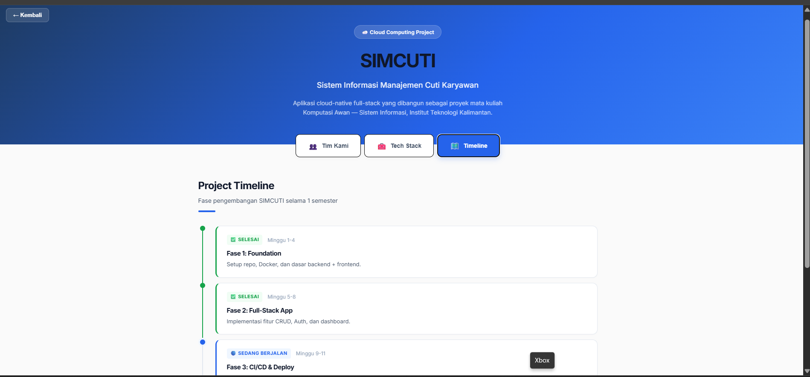

## Deskripsi

<!-- PR baru: hapus blok referensi tim di bawah jika tidak relevan -->

### Referensi aktivitas di `main` (1 Mei & 2 Mei 2026)

Ringkasannya mengikuti [riwayat commit `main` di repo](https://github.com/aidilsaputrakirsan-classroom/cc-kelompok-taskete_7/commits/main/).

**2 Mei 2026**
- `feat: add compose profiles and production override (#4)` — compose + file override produksi.
- Merge **PR `#7`** `feature/health-endpoint` — health check backend (termasuk koneksi DB).

**1 Mei 2026**
- `feat: implement functional health check with database status`
- Merge **PR `#5`** `feature/about-page` — halaman **Tentang Proyek / About**.
- `fix: bug fix in tech stack can't render` — perbaikan render bagian Tech Stack di About.
- `style: enhance about page with minimalist design` — penyempurnaan UI About.
- `feat: add about page structure and team data`.
- Dokumentasi: `Docs/milestone1 retrospective (#6)`, `docs: add milestone 1 retrospective (#2)`.
- `Chore/add codeowners (#1)` — `.github/CODEOWNERS`; uji/`revert` terkait **branch protection** (commit test & revert).

—

## Deskripsi PR ini

<!-- Jelaskan perubahan spesifik di branch Anda -->

## Jenis Perubahan

Sesuai jenis commit di atas (boleh centang lebih dari satu; untuk PR baru, sesuaikan):

- [x] ✨ Fitur baru (**feat** — About, endpoint health lengkap dengan status DB, compose profiles + override prod).
- [x] 🐛 Bug fix (**fix** — Tech Stack tidak ter-render).
- [x] 📝 Dokumentasi (**docs** — milestone / retrospective Milestone 1).
- [x] ♻️ Refactoring (**style/UI** About — penyempitan & penataan minimalist).
- [x] 🔧 Konfigurasi / chore (**chore** — CODEOWNERS, Docker Compose/dev-prod workflow, tes rules / revert).

Untuk satu PR baru, biasanya centang yang **betul‑betul ada di branch** PR itu saja.

## Checklist

Pastikan mencakup pekerjaan yang masuk periode tersebut (hilangkan atau kosongkan jika tidak berlaku):

- [x] **Docker Compose** — `docker compose up -d --build` jalan; opsi override prod (`docker-compose.prod.yml`) memahami bila digunakan.
- [x] **Backend health** — `GET /health` / Swagger menunjukkan status layanan dan DB konsisten dengan implementasi.
- [x] **Frontend About** — alur Tentang Proyek dari login/dashboard; Tech Stack tidak error render.
- [x] **Dokumen tim** — file retrospective Milestone 1 / milestone docs sudah konsisten lokasi repo.
- [x] **Git workflow** — CODEOWNERS; branch protection (push ke `main` lewat PR, bukan langsung).
- [x] Kode / konfig yang relevan sudah dicoba lokal atau di lingkungan tim.
- [x] Tidak ada hardcoded secrets/credentials pada perubahan tim.
- [x] Pesan commit pada branch mengikuti **Conventional Commits** (`feat:` / `fix:` / `docs:` / `style:` / `chore:`).
- [x] README atau `docker-compose`/docs di-root diupdate (**centang jika ada perubahan perlu disebut di README**).

## Screenshot (jika ada perubahan UI)

- [x] About / Tentang Proyek — tab **Tim Kami**, **Tech Stack**, dan **Timeline**.

### Cuplikan layar — SIMCUTI Tentang Proyek

**Tab Tim Kami**

**Tab Tech Stack** (diagram arsitektur + kartu teknologi)

**Tab Timeline** (fase pengembangan)

- [ ] (Opsional) Swagger `/docs` atau response `/health` setelah merge health endpoint.
