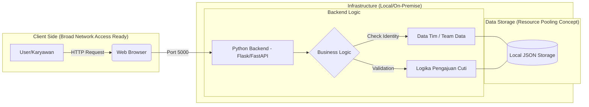

# ☁️ Cloud App - [SIMCUTI - Sistem Manajemen Cuti Karyawan]

Aplikasi ini adalah platform manajemen Sumber Daya Manusia (SDM) digital yang dirancang untuk menyederhanakan proses pengajuan dan pemantauan cuti karyawan secara real-time. Dikembangkan khusus untuk perusahaan skala menengah, sistem ini memungkinkan karyawan untuk memeriksa sisa jatah cuti mereka secara mandiri dan mengajukan permohonan izin melalui antarmuka web yang responsif. Dengan integrasi sistem approval otomatis, manajer dapat meninjau, menyetujui, atau menolak permohonan cuti hanya dengan satu klik, sehingga menghilangkan birokrasi manual yang lambat.

Masalah utama yang diselesaikan oleh aplikasi ini adalah ketidakefisienan dalam pencatatan cuti konvensional yang sering kali masih menggunakan formulir kertas atau spreadsheet manual yang rentan terhadap kesalahan data. Dengan memanfaatkan infrastruktur Cloud Computing, sistem ini menjamin ketersediaan data yang tinggi (high availability) dan aksesibilitas dari mana saja. Hal ini memberikan transparansi penuh antara pihak manajemen dan karyawan, sekaligus mengurangi beban administratif tim HR dalam mengelola sinkronisasi data sisa cuti yang akurat.

## 👥 Tim

| Nama | NIM | Peran |
|------|-----|-------|
| Noviansyah  | 10231072 | Lead Backend |
| Irwan Maulana  | 10231046 | Lead Frontend |
| Rayhan Iqbal  | 10231080 | Lead DevOps |
| Amalia Tiara Rezfani  | 10231012 | Lead QA & Docs |

## 🛠️ Tech Stack

| Teknologi | Fungsi |
|-----------|--------|
| FastAPI   | Backend REST API |
| React     | Frontend SPA |
| PostgreSQL | Database |
| Docker    | Containerization |
| GitHub Actions | CI/CD |
| Railway/Render | Cloud Deployment |

## 🏗️ Architecture

```


*(Diagram ini akan berkembang setiap minggu)*

## 🚀 Getting Started

### Prasyarat
- Python 3.10+
- Node.js 18+
- Git

### Backend
```bash
cd backend
pip install -r requirements.txt
uvicorn main:app --reload --port 8000
```

Buka http://localhost:8000 untuk verifikasi API berjalan.

Buka http://localhost:8000/docs untuk melihat dokumentasi Swagger.

### Frontend
```bash
cd frontend
npm install
npm run dev
```

Buka http://localhost:5173 untuk melihat aplikasi.

## 📅 Roadmap

| Minggu | Target | Status |
|--------|--------|--------|
| 1 | Setup & Hello World | ✅ |
| 2 | REST API + Database | ⬜ |
| 3 | React Frontend | ⬜ |
| 4 | Full-Stack Integration | ⬜ |
| 5-7 | Docker & Compose | ⬜ |
| 8 | UTS Demo | ⬜ |
| 9-11 | CI/CD Pipeline | ⬜ |
| 12-14 | Microservices | ⬜ |
| 15-16 | Final & UAS | ⬜ |


## 📁 Project Structure

```
cc-kelompok-taskete_7/
├── backend/
│   ├── main.py
│   ├── requirements.txt
│   └── frontend/
│       ├── src/
│       ├── public/
│       ├── index.html
│       ├── package.json
│       └── ...
├── frontend/
│   ├── src/
│   ├── public/
│   ├── index.html
│   ├── package.json
│   └── ...
├── docs/
│   ├── member-[iqbal].md
│   ├── member-[Irwan].md
│   ├── member-[opi].md
│   └── member-Amalia-Tiara-Rezfani.md
├── .gitignore
└── README.md
```

*Struktur ini akan berkembang sesuai milestone mingguan.*
