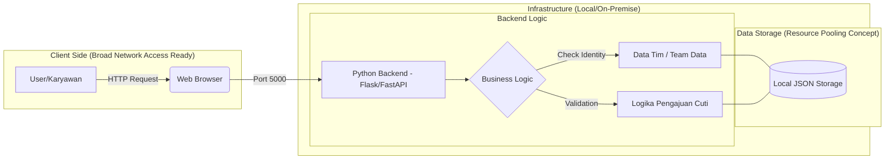

# ☁️ Cloud App - [SIMCUTI - Sistem Manajemen Cuti Karyawan]

Aplikasi ini adalah platform manajemen Sumber Daya Manusia (SDM) digital yang dirancang untuk menyederhanakan proses pengajuan dan pemantauan cuti karyawan secara real-time. Dikembangkan khusus untuk perusahaan skala menengah, sistem ini memungkinkan karyawan untuk memeriksa sisa jatah cuti mereka secara mandiri dan mengajukan permohonan izin melalui antarmuka web yang responsif. Dengan integrasi sistem approval otomatis, manajer dapat meninjau, menyetujui, atau menolak permohonan cuti hanya dengan satu klik, sehingga menghilangkan birokrasi manual yang lambat.

Masalah utama yang diselesaikan oleh aplikasi ini adalah ketidakefisienan dalam pencatatan cuti konvensional yang sering kali masih menggunakan formulir kertas atau spreadsheet manual yang rentan terhadap kesalahan data. Dengan memanfaatkan infrastruktur Cloud Computing, sistem ini menjamin ketersediaan data yang tinggi (high availability) dan aksesibilitas dari mana saja. Hal ini memberikan transparansi penuh antara pihak manajemen dan karyawan, sekaligus mengurangi beban administratif tim HR dalam mengelola sinkronisasi data sisa cuti yang akurat.

## 👥 Tim

| Nama | NIM | Peran |
|------|-----|-------|
| Noviansyah  | 10231072 | Lead Backend |
| Irwan Maulana  | 10231046 | Lead Frontend |
| Rayhan Iqbal  | 10231080 | Lead DevOps |
| Amalia Tiara Rezfani  | 10231012 | Lead QA & Docs |

## 🛠️ Tech Stack

| Teknologi | Fungsi |
|-----------|--------|
| FastAPI   | Backend REST API |
| React     | Frontend SPA |
| PostgreSQL | Database |
| Docker    | Containerization |
| GitHub Actions | CI/CD |
| Railway/Render | Cloud Deployment |

## 🏗️ Architecture


```mermaid
graph LR
    subgraph "Client Side (Broad Network Access Ready)"
        A[User/Karyawan] -->|HTTP Request| B(Web Browser)
    end

    subgraph "Infrastructure (Local/On-Premise)"
        B -->|Port 5000| C[Python Backend - Flask/FastAPI]
        
        subgraph "Backend Logic"
            C --> D{Business Logic}
            D -->|Check Identity| E[Data Tim / Team Data]
            D -->|Validation| F[Logika Pengajuan Cuti]
        end
        
        subgraph "Data Storage (Resource Pooling Concept)"
            E --- G[(Local JSON Storage)]
            F --- G
        end
    end
```

*(Diagram ini akan berkembang setiap minggu)*

## 🚀 Getting Started

### Prasyarat
- Python 3.10+

  digunakan sebagai dasar untuk menjalankan sisi backend aplikasi yang dibangun dengan FastAPI. Versi ini dipilih karena sudah mendukung fitur terbaru serta kompatibel dengan berbagai library yang digunakan oleh FastAPI.

  Dalam implementasinya, Python berperan untuk:

  - Menjalankan server API menggunakan uvicorn
  - Mengelola dan menginstal library melalui pip
  - Menangani seluruh proses dan logika bisnis di backend
  
- Node.js 18+
  
    Node.js digunakan untuk menjalankan bagian frontend yang dibangun menggunakan React. Versi 18 ke atas direkomendasikan karena sudah mendukung fitur JavaScript terbaru serta kompatibel dengan tools modern seperti Vite.

    Peran Node.js dalam pengembangan frontend meliputi:

    - Menginstal berbagai dependency menggunakan npm install
    - Menjalankan server development dengan npm run dev
    - Mengelola package dan kebutuhan proyek frontend

    Tanpa Node.js, aplikasi frontend tidak dapat dijalankan dengan baik.


- Git
  
  Git merupakan sistem version control yang digunakan untuk mengelola kode selama proses pengembangan. Dengan Git, pengembang dapat melacak perubahan serta bekerja secara kolaboratif dalam satu proyek.

    Fungsi utama Git antara lain:

    - Mengambil (clone) repository dari server
    - Mengatur dan mencatat perubahan kode
    - Memudahkan kerja sama dalam tim
    - Mendukung integrasi dengan platform seperti  GitHub serta proses CI/CD

## 📖 Quick Start

Pastikan Docker Desktop sudah terinstal dan dalam kondisi aktif sebelum memulai.

```
docker compose up -d
```

Menjalankan aplikasi dapat diakses melalui : 

- Frontend : http://localhost:3000
- Backend API : http://localhost:8000
- API Documentation: http://localhost:8000/docs

### Menghentikan Aplikasi 

Untuk menghentikan semua service, jalankan perintah berikut:

```
docker compose down
```

## 🐳 Docker Compose Commands

Berikut adalah beberapa perintah dasar Docker Compose yang digunakan:

| Command                         | Keterangan                                   |
|--------------------------------|----------------------------------------------|
| docker compose up              | Menjalankan seluruh service                  |
| docker compose up -d           | Menjalankan service di background (detached) |
| docker compose down            | Menghentikan sekaligus menghapus container   |
| docker compose logs            | Menampilkan log dari semua service           |
| docker compose ps              | Menampilkan status container                 |
| docker compose up -d --build   | Build ulang image lalu menjalankan service   |

## 📅 Roadmap

| Minggu | Target | Status |
|--------|--------|--------|
| 1 | Setup & Hello World | ✅ |
| 2 | REST API + Database | ✅ |
| 3 | React Frontend | ✅ |
| 4 | Full-Stack Integration | ✅ |
| 5-7 | Docker & Compose | ⬜ |
| 8 | UTS Demo | ⬜ |
| 9-11 | CI/CD Pipeline | ⬜ |
| 12-14 | Microservices | ⬜ |
| 15-16 | Final & UAS | ⬜ |


## 📁 Project Structure

```
cc-kelompok-taskete_7/
├── Screenshotmodul4/
│   ├── 1.png
│   ├── 2.png
│   ├── 3.png
│   ├── 4.png
│   ├── 5.png
│   ├── 6.png
│   ├── 7.png
│   ├── 8.png
│   ├── 9.png
│   ├── 10.png
│   ├── 11.png
│   ├── 12.png
│   ├── 13.png
│   └── 14.png
│
├── backend/
│   ├── .env.example         # Template konfigurasi database
│   ├── auth.py              # Autentikasi & otorisasi user
│   ├── crud.py              # Fungsi CRUD (business logic)
│   ├── database.py          # Koneksi PostgreSQL via SQLAlchemy
│   ├── main.py              # Entry point, FastAPI endpoints
│   ├── models.py            # SQLAlchemy models (tabel database)
│   ├── package-lock.json    # Lockfile yang sempat ter-track
│   ├── requirements.txt     # Python dependencies
│   ├── schemas.py           # Pydantic validation schemas
│   └── setup.sh             # Script setup otomatis
│   
├── docs/
│   ├── screenshots/
│   │   ├── 1-keyboard.png
│   │   ├── 1-laptop.png
│   │   ├── 1-mouse.png
│   │   ├── 2-list-all-items.png
│   │   ├── 3-get-single-items.png
│   │   ├── 4-update-items.png
│   │   ├── 5-check-updated-items.png
│   │   ├── 6-search-items.png
│   │   ├── 7-delete-items.png
│   │   └── 8-verify-delete.png
│   ├── api-documentation.md
│   ├── api-test-results.md
│   ├── database-schema.md
│   ├── hapus semua items.png
│   ├── image.png
│   ├── member-[iqbal].md
│   ├── member-[Irwan].md
│   ├── member-[opi].md
│   ├── member-Amalia-Tiara-Rezfani.md
│   ├── Screenshot 2026-03-13 000253.png
│   ├── Screenshot 2026-03-13 000522.png
│   ├── Screenshot 2026-03-13 001113.png
│   ├── Screenshot 2026-03-13 001332-1.png
│   ├── Screenshot 2026-03-13 001332.png
│   ├── Screenshot 2026-03-13 001656.png
│   ├── Screenshot 2026-03-13 002120.png
│   ├── Screenshot 2026-03-13 002343.png
│   ├── Screenshot 2026-03-13 002531.png
│   ├── Screenshot 2026-03-13 003134.png
│   ├── Screenshot 2026-03-13 003226.png
│   ├── Screenshot 2026-03-13 003353.png
│   └── ui-test-results.md
│
├── frontend/
│   ├── public/
│   │   └── vite.svg
│   ├── src/
│   │   ├── assets/
│   │   │   └── react.svg
│   │   ├── components/
│   │   │   ├── Header.jsx
│   │   │   ├── ItemCard.jsx
│   │   │   ├── ItemForm.jsx
│   │   │   ├── ItemList.jsx
│   │   │   ├── LoginPage.jsx
│   │   │   ├── SearchBar.jsx
│   │   │   ├── SortDropdown.jsx
│   │   │   ├── Spinner.jsx
│   │   │   └── Toast.jsx
│   │   ├── services/
│   │   │   └── api.js
│   │   ├── api.js
│   │   ├── App.css
│   │   ├── App.jsx
│   │   ├── index.css
│   │   └── main.jsx
│   ├── .env.example         # Template env frontend (Vite)
│   ├── .gitignore
│   ├── eslint.config.js
│   ├── index.html
│   ├── package-lock.json
│   ├── package.json
│   ├── README.md
│   └── vite.config.js
│ 
├── .gitignore
└── README.md
```

*Struktur ini akan berkembang sesuai milestone mingguan.*


# Modul 2 - API Endpoints

Berikut merupakan daftar endpoint pada REST API yang digunakan untuk mengelola data item serta menampilkan informasi sistem.

| Method  | Endpoint | Deskripsi |
|----------|----------|----------|
| POST   |```/items``` | Menambahkan data item baru ke dalam database|
| GET    |```/items```| Mengambil daftar item dengan fitur pagination dan pencarian|
| GET    |```/items/{item_id}```| Mengambil data item berdasarkan ID|
| PUT    |```/items/{item_id}```| Memperbarui data item berdasarkan ID|
| DELETE |```/items/{item_id}```| Menghapus data item berdasarkan ID|
| GET    | ```/health ```| Digunakan untuk mengecek apakah API atau server berjalan dengan baik|
| GET    | ```/team```| menampilkan informasi tim pengembang API beserta nama, NIM, dan peran masing-masing anggota|

## Endpoint ```/items```

```
@app.post("/items", response_model=ItemResponse, status_code=201)
def create_item(item: ItemCreate, db: Session = Depends(get_db)):
    """
    Buat item baru.
    
    - **name**: Nama item (wajib, 1-100 karakter)
    - **price**: Harga (wajib, > 0)
    - **description**: Deskripsi (opsional)
    - **quantity**: Jumlah stok (default: 0)
    """
    return crud.create_item(db=db, item_data=item) 
```

METHOD : ```POST```

URL : ```/items```

Deskripsi : Digunakan untuk menambahkan data baru ke dalam database dan memvalidasinya melalui Pydantic. 

Request Body :
 ```
 {
   "name": "Laptop",
    "description": "Laptop untuk cloud computing",
    "price": 15000000,
    "quatity": 5,
 }  
```

Response Example : 201 CREATED
```
{
    "id": 1,
    " "created_at": "2026-03-04T13:17:15.549271+08:00",
    "updated_at": null
}
```

## Endpoint ```/items```
```
@app.get("/items", response_model=ItemListResponse)
def list_items(
    skip: int = Query(0, ge=0, description="Jumlah data yang di-skip"),
    limit: int = Query(20, ge=1, le=100, description="Jumlah data per halaman"),
    search: str = Query(None, description="Cari berdasarkan nama/deskripsi"),
    db: Session = Depends(get_db),
):
    """
    Ambil daftar items dengan pagination dan search.
    
    - **skip**: Offset untuk pagination (default: 0)
    - **limit**: Jumlah item per halaman (default: 20, max: 100)
    - **search**: Kata kunci pencarian (opsional)
    """
    return crud.get_items(db=db, skip=skip, limit=limit, search=search)
```
METHOD : ```GET```

URL : ```/items```

Deskripsi : Mengambil banyak data dengan filter pagination dan pencarian  

Request Body : 

Response Example : 


## Endpoint ```/items/{item_id}```
```
@app.get("/items/{item_id}", response_model=ItemResponse)
def get_item(item_id: int, db: Session = Depends(get_db)):
    """Ambil satu item berdasarkan ID."""
    item = crud.get_item(db=db, item_id=item_id)
    if not item:
        raise HTTPException(status_code=404, detail=f"Item dengan id={item_id} tidak ditemukan")
    return item
```

METHOD : ```GET```

URL : ```/items/{item_id}```

Deskripsi : Mengambil satu data spesifik berdasarkan ID 

Request Body : 
```
http://127.0.0.1:80000/items?skip-0&limit-20
```

Response Example : 


## Endpoint ```/items/{item_id}```

```
@app.put("/items/{item_id}", response_model=ItemResponse)
def update_item(item_id: int, item: ItemUpdate, db: Session = Depends(get_db)):
    """
    Update item berdasarkan ID.
    Hanya field yang dikirim yang akan di-update (partial update).
    """
    updated = crud.update_item(db=db, item_id=item_id, item_data=item)
    if not updated:
        raise HTTPException(status_code=404, detail=f"Item dengan id={item_id} tidak ditemukan")
    return updated
```

METHOD : ```PUT```

URL : ```/items/{item_id}```

Deskripsi : Mengubah atau memperbarui data berdasarkan ID 
Request Body : 

Response Example :


## Endpoint ```/items/{item_id}```

```
@app.delete("/items/{item_id}", status_code=204)
def delete_item(item_id: int, db: Session = Depends(get_db)):
    """Hapus item berdasarkan ID."""
    success = crud.delete_item(db=db, item_id=item_id)
    if not success:
        raise HTTPException(status_code=404, detail=f"Item dengan id={item_id} tidak ditemukan")
    return None
```

METHOD : ```DELETE```

URL : ```/items/{item_id}```

Deskripsi : Menghapus data dari database berdasarkan ID 

Request Body : 

Response Example :

## Endpoint ```/health```

```
@app.get("/health")
def health_check():
    """Endpoint untuk mengecek apakah API berjalan."""
    return {"status": "healthy", "version": "0.2.0"}
```

METHOD : ```GET```

URL : ```/health```

Deskripsi : Digunakan untuk mengecek apakah API atau server berjalan dengan baik

Request Body : 

Response Example :


## Endpoint ```/team```

```
@app.get("/team")
def team_info():
    """Informasi tim."""
    return {
        "team": "cc-kelompok-taskete_7",
        "members": [
            {"name": "Noviansyah", "nim": "10231072", "role": "Lead Backend"},
            {"name": "Irwan Maulana", "nim": "10231046", "role": "Lead Frontend"},
            {"name": "Rayhan Iqbal", "nim": "10231080", "role": "Lead DevOps"},
            {"name": "Amalia Tiara Rezfani", "nim": "10231012", "role": "Lead QA & Docs"},
        ],
    }
```

METHOD : ```GET```

URL : ```/team```

Deskripsi : Digunakan untuk menampilkan informasi tim pengembang API beserta nama, NIM, dan peran masing-masing anggota

Request Body : 

Response Example :


# Modul 3 - Frontend REACT - UI & API Integration

1. Membuat Struktur Folder Bagian Frontend

Pada langkah ini dilakukan pembuatan struktur folder pada bagian frontend untuk merapikan pengelompokan kode. Setelah masuk ke direktori frontend/src, dibuat dua folder utama yaitu components dan services. Folder components digunakan untuk menyimpan komponen antarmuka (UI) yang dapat digunakan kembali, sedangkan folder services digunakan untuk menampung logika layanan seperti pemanggilan API. Struktur ini membantu pengembangan menjadi lebih terorganisir dan memudahkan pemeliharaan kode.

2. Membuat API Service Layer

Pada langkah ini dibuat file api.js di dalam folder services yang berfungsi sebagai penghubung antara frontend dan backend. Di dalam file ini dituliskan berbagai fungsi untuk melakukan operasi CRUD seperti mengambil data (GET), menambahkan data (POST), mengubah data (PUT), dan menghapus data (DELETE). Selain itu, terdapat juga fungsi untuk mengecek status koneksi API. Dengan adanya service layer ini, pemanggilan API menjadi lebih terstruktur dan tidak ditulis berulang di berbagai komponen.

3. Membuat Komponen Header dan SearchBar

Pada langkah ini dibuat dua komponen utama yaitu Header dan SearchBar yang disimpan dalam folder components. Komponen Header digunakan untuk menampilkan informasi aplikasi seperti judul, jumlah item, dan status koneksi API. Sedangkan komponen SearchBar digunakan untuk melakukan pencarian data berdasarkan kata kunci yang dimasukkan oleh pengguna. Kedua komponen ini membantu meningkatkan pengalaman pengguna dalam berinteraksi dengan aplikasi.

4. Membuat Komponen ItemForm

Pada langkah ini dibuat komponen ItemForm yang berfungsi sebagai form untuk menambahkan dan mengedit data item. Form ini dilengkapi dengan validasi input seperti memastikan nama item tidak kosong dan harga lebih dari nol. Selain itu, form juga dapat menyesuaikan mode antara tambah dan edit berdasarkan data yang diterima. Komponen ini menjadi bagian penting dalam proses input data oleh pengguna.

5. Membuat Komponen ItemCard dan ItemList
Membuat dua komponen yaitu ItemCard dan ItemList. Komponen ItemCard digunakan untuk menampilkan informasi satu item secara detail seperti nama, harga, deskripsi, stok, dan tanggal. Sementara itu, ItemList berfungsi sebagai wadah untuk menampilkan seluruh data item dalam bentuk daftar atau grid. Komponen ini juga menangani kondisi seperti loading data dan tampilan ketika data masih kosong.

6. Mengatur Root Component (App.jsx)
Pada langkah ini dilakukan pengaturan komponen utama yaitu App.jsx yang berfungsi sebagai pusat pengendali aplikasi. Di dalamnya dikelola berbagai state seperti data item, status loading, koneksi API, dan data yang sedang diedit. Selain itu, ditambahkan juga fungsi untuk menangani operasi CRUD, pencarian data, serta pengambilan data dari API. Komponen ini menghubungkan semua komponen lain sehingga aplikasi dapat berjalan secara utuh.


7. Mengatur CSS dan Styling
dilakukan penyesuaian terhadap file App.css untuk mereset gaya bawaan dari Vite dan browser. Hal ini bertujuan agar tampilan aplikasi menjadi lebih konsisten dan rapi. Selain itu, ditambahkan juga efek sederhana pada elemen seperti input dan tombol untuk meningkatkan tampilan antarmuka.


8. Menjalankan dan Menguji Aplikasi

Pada langkah terakhir dilakukan proses menjalankan aplikasi menggunakan perintah npm run dev. Setelah itu, aplikasi dibuka melalui browser pada alamat http://localhost:5173. Pengujian dilakukan untuk memastikan seluruh fitur seperti menampilkan data, menambah, mengedit, menghapus, dan mencari item dapat berjalan dengan baik.

### ✅ UI Test Result
Testing dilakukan dengan melalui 10 Test Case. Berikut 10 Test Case pengujiannya:

1. Cek Status API ✅
2. Items dari Modul 2 muncul di daftar ✅
3. Menambahkan item baru via form ✅
4. Item muncul pada daftar ✅
5. Melakukan klik edit pada Item ✅
6. Form berisi data lama, Mengubah harga & klik update ✅
7. Mencari Item via searchbar ✅
8. Menghapus item & Confirm Dialog Muncul ✅
9. Item akan hilang dari daftar ✅
10.  Menghapus semua, dan muncul Empty State ✅
    

Hasil testing/penguujian tersebut terdapat pada file docs/ui-test-result.md 


# Modul 4 - Testing End-to-End

Pada tahap ini dilakukan pengujian awal dengan membuka aplikasi melalui browser menggunakan alamat ```http://localhost:5173```. Untuk memastikan bahwa frontend berhasil dijalankan dan dapat diakses dengan baik oleh pengguna dan mengecek status API Connected untuk memastikan bahwa komunikasi antara frontend dan backend berjalan dengan baik sebelum melakukan pengujian fitur lainnya.

| No | Pengujian | Hasil yang Diharapkan | Status |
|----|-----------|------------------------|--------|
| 1 | Buka `localhost:3000` | Halaman login muncul | ✅ Berhasil |
| 2 | Register user baru | User baru berhasil didaftarkan | ✅ Berhasil|
| 3 | Setelah register | User otomatis login | ✅ Berhasil |
| 4 | Masuk ke aplikasi utama | Halaman utama dan daftar items muncul | ✅ Berhasil |
| 5 | Header aplikasi | Nama user tampil di header | ✅ Berhasil |
| 6 | CRUD items | Tambah, edit, dan hapus item berfungsi | ✅ Berhasil|
| 7 | Klik Logout | User berhasil logout | ✅ Berhasil|
| 8 | Setelah logout | Kembali ke halaman login | ✅ Berhasil|
| 9 | Login kembali dengan akun tadi | Login berhasil |✅ Berhasil |
| 10 | Setelah login kembali | Data items masih ada | ✅ Berhasil|

**Hasil akhir:** SEMUA PASS ✅


## Endpoint API 

### API Endpoint List


| No | Method | Endpoint        | Access        | Deskripsi                          |
|----|--------|-----------------|---------------|------------------------------------|
| 1  | GET   | ```/health ```         | Public        | Melakukan pengecekan kondisi server untuk memastikan API berjalan dengan baik   |
| 2  | POST   | ```/auth/register ```  | Public        | Melakukan pendaftaran user baru dengan menyimpan data pengguna ke database      |
| 3  | POST   | ```/auth/login```     | Protected | Melakukan proses login untuk memverifikasi user dan menghasilkan token autentikasi               |
| 4  | GET    | ```/auth/me ```       | Protected | Mengambil informasi data user yang sedang login berdasarkan token yang diberikan                  |
| 5  | POST   | ```/items```          | Protected | Menambahkan data item baru ke dalam database sesuai input yang diberikan pengguna              |
| 6  | GET    | ```/items```          | Protected       | Mengambil seluruh data item dari database untuk ditampilkan ke pengguna      |
| 7  | GET    | ```/items/{item_id}``` | Protected        |   Mengambil detail data item berdasarkan ID tertentu dari database      |
| 8  | PUT    | ```/items/{item_id}``` | Protected       | Memperbarui atau mengubah data item yang sudah ada berdasarkan ID tertentu   |
| 9  | DELETE | ```/items/{item_id}``` | Protected        |  Menghapus data item dari database berdasarkan ID yang dipilih       |
| 10  | GET   | ```/team ```            | Public        | Mengambil informasi data tim pengembang yang ditampilkan pada aplikasi |


[Modul 2 - Dokumentasi pengujian seluruh endpoint API menggunakan Swagger ](docs/api-test-results.md)

[Modul 3 - Dokumentasi ui test result ](docs/ui-test-results.md)

[Modul 6 - Perbandingan base image Python](docs/image-comparison.md)

[Modul 6 - Ukuran image SIMCUTI sebelum vs sesudah optimasi + push Docker Hub](docs/image-optimization-simcuti.md)

[Modul 7 - Hasil pengujian Makefile (`make up`, `down`, `logs`, `build`, `clean`)](docs/makefile-testing-results.md)

