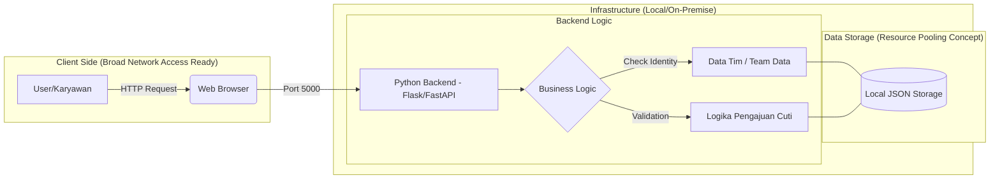

# ☁️ Cloud App - [SIMCUTI - Sistem Manajemen Cuti Karyawan]

Aplikasi ini adalah platform manajemen Sumber Daya Manusia (SDM) digital yang dirancang untuk menyederhanakan proses pengajuan dan pemantauan cuti karyawan secara real-time. Dikembangkan khusus untuk perusahaan skala menengah, sistem ini memungkinkan karyawan untuk memeriksa sisa jatah cuti mereka secara mandiri dan mengajukan permohonan izin melalui antarmuka web yang responsif. Dengan integrasi sistem approval otomatis, manajer dapat meninjau, menyetujui, atau menolak permohonan cuti hanya dengan satu klik, sehingga menghilangkan birokrasi manual yang lambat.

Masalah utama yang diselesaikan oleh aplikasi ini adalah ketidakefisienan dalam pencatatan cuti konvensional yang sering kali masih menggunakan formulir kertas atau spreadsheet manual yang rentan terhadap kesalahan data. Dengan memanfaatkan infrastruktur Cloud Computing, sistem ini menjamin ketersediaan data yang tinggi (high availability) dan aksesibilitas dari mana saja. Hal ini memberikan transparansi penuh antara pihak manajemen dan karyawan, sekaligus mengurangi beban administratif tim HR dalam mengelola sinkronisasi data sisa cuti yang akurat.

## 👥 Tim

| Nama | NIM | Peran |
|------|-----|-------|
| Noviansyah  | 10231072 | Lead Backend |
| Irwan Maulana  | 10231046 | Lead Frontend |
| Rayhan Iqbal  | 10231080 | Lead DevOps |
| Amalia Tiara Rezfani  | 10231012 | Lead QA & Docs |

## 🛠️ Tech Stack

| Teknologi | Fungsi |
|-----------|--------|
| FastAPI   | Backend REST API |
| React     | Frontend SPA |
| PostgreSQL | Database |
| Docker    | Containerization |
| GitHub Actions | CI/CD |
| Railway/Render | Cloud Deployment |

## 🏗️ Architecture


```mermaid
graph LR
    subgraph "Client Side (Broad Network Access Ready)"
        A[User/Karyawan] -->|HTTP Request| B(Web Browser)
    end

    subgraph "Infrastructure (Local/On-Premise)"
        B -->|Port 5000| C[Python Backend - Flask/FastAPI]
        
        subgraph "Backend Logic"
            C --> D{Business Logic}
            D -->|Check Identity| E[Data Tim / Team Data]
            D -->|Validation| F[Logika Pengajuan Cuti]
        end
        
        subgraph "Data Storage (Resource Pooling Concept)"
            E --- G[(Local JSON Storage)]
            F --- G
        end
    end
```

*(Diagram ini akan berkembang setiap minggu)*

## 🚀 Getting Started

### Prasyarat
- Python 3.10+
- Node.js 18+
- Git

### Backend
```bash
cd backend
pip install -r requirements.txt
uvicorn main:app --reload --port 8000
```

Buka http://localhost:8000 untuk verifikasi API berjalan.

Buka http://localhost:8000/docs untuk melihat dokumentasi Swagger.

### Frontend
```bash
cd frontend
npm install
npm run dev
```

Buka http://localhost:5173 untuk melihat aplikasi.

## 📅 Roadmap

| Minggu | Target | Status |
|--------|--------|--------|
| 1 | Setup & Hello World | ✅ |
| 2 | REST API + Database | ✅ |
| 3 | React Frontend | ⬜ |
| 4 | Full-Stack Integration | ⬜ |
| 5-7 | Docker & Compose | ⬜ |
| 8 | UTS Demo | ⬜ |
| 9-11 | CI/CD Pipeline | ⬜ |
| 12-14 | Microservices | ⬜ |
| 15-16 | Final & UAS | ⬜ |


## 📁 Project Structure

```
cc-kelompok-taskete_7/
├── backend/
│   ├── .env.example         # Template konfigurasi database
│   ├── crud.py              # Fungsi CRUD (business logic)
│   ├── database.py          # Koneksi PostgreSQL via SQLAlchemy
│   ├── main.py              # Entry point, FastAPI endpoints
│   ├── models.py            # SQLAlchemy models (tabel database)
│   ├── requirements.txt     # Python dependencies
│   ├── schemas.py           # Pydantic validation schemas
│   └── setup.sh             # Script setup otomatis
├── docs/
│   ├── screenshots/         # Screenshot hasil testing API
│   ├── api-test-results.md  # Dokumentasi hasil testing endpoint
│   ├── database-schema.md   # Schema database (tabel, kolom, tipe data)
│   ├── member-[iqbal].md
│   ├── member-[Irwan].md
│   ├── member-[opi].md
│   └── member-Amalia-Tiara-Rezfani.md
├── frontend/
│   ├── public/
│   │   └── vite.svg
│   ├── src/
│   │   ├── assets/
│   │   │   └── react.svg
│   │   ├── App.css
│   │   ├── App.jsx
│   │   ├── index.css
│   │   └── main.jsx
│   ├── .gitignore
│   ├── eslint.config.js
│   ├── index.html
│   ├── package.json
│   ├── README.md
│   └── vite.config.js
├── .gitignore
└── README.md
```

*Struktur ini akan berkembang sesuai milestone mingguan.*


# Modul 2 - API Endpoints

Berikut merupakan daftar endpoint pada REST API yang digunakan untuk mengelola data item serta menampilkan informasi sistem.

| Method  | Endpoint | Deskripsi |
|----------|----------|----------|
| POST   |```/items``` | Menambahkan data item baru ke dalam database|
| GET    |```/items```| Mengambil daftar item dengan fitur pagination dan pencarian|
| GET    |```/items/{item_id}```| Mengambil data item berdasarkan ID|
| PUT    |```/items/{item_id}```| Memperbarui data item berdasarkan ID|
| DELETE |```/items/{item_id}```| Menghapus data item berdasarkan ID|
| GET    | ```/health ```| Digunakan untuk mengecek apakah API atau server berjalan dengan baik|
| GET    | ```/team```| menampilkan informasi tim pengembang API beserta nama, NIM, dan peran masing-masing anggota|

## Endpoint ```/items```

```
@app.post("/items", response_model=ItemResponse, status_code=201)
def create_item(item: ItemCreate, db: Session = Depends(get_db)):
    """
    Buat item baru.
    
    - **name**: Nama item (wajib, 1-100 karakter)
    - **price**: Harga (wajib, > 0)
    - **description**: Deskripsi (opsional)
    - **quantity**: Jumlah stok (default: 0)
    """
    return crud.create_item(db=db, item_data=item) 
```

METHOD : ```POST```

URL : ```/items```

Deskripsi : Digunakan untuk menambahkan data baru ke dalam database dan memvalidasinya melalui Pydantic. 

Request Body : 

Response Example : 


## Endpoint ```/items```
```
@app.get("/items", response_model=ItemListResponse)
def list_items(
    skip: int = Query(0, ge=0, description="Jumlah data yang di-skip"),
    limit: int = Query(20, ge=1, le=100, description="Jumlah data per halaman"),
    search: str = Query(None, description="Cari berdasarkan nama/deskripsi"),
    db: Session = Depends(get_db),
):
    """
    Ambil daftar items dengan pagination dan search.
    
    - **skip**: Offset untuk pagination (default: 0)
    - **limit**: Jumlah item per halaman (default: 20, max: 100)
    - **search**: Kata kunci pencarian (opsional)
    """
    return crud.get_items(db=db, skip=skip, limit=limit, search=search)
```
METHOD : ```GET```

URL : ```/items```

Deskripsi : Mengambil banyak data dengan filter pagination dan pencarian  

Request Body : 

Response Example : 


## Endpoint ```/items/{item_id}```
```
@app.get("/items/{item_id}", response_model=ItemResponse)
def get_item(item_id: int, db: Session = Depends(get_db)):
    """Ambil satu item berdasarkan ID."""
    item = crud.get_item(db=db, item_id=item_id)
    if not item:
        raise HTTPException(status_code=404, detail=f"Item dengan id={item_id} tidak ditemukan")
    return item
```

METHOD : ```GET```

URL : ```/items/{item_id}```

Deskripsi : Mengambil satu data spesifik berdasarkan ID 

Request Body : 

Response Example : 


## Endpoint ```/items/{item_id}```

```
@app.put("/items/{item_id}", response_model=ItemResponse)
def update_item(item_id: int, item: ItemUpdate, db: Session = Depends(get_db)):
    """
    Update item berdasarkan ID.
    Hanya field yang dikirim yang akan di-update (partial update).
    """
    updated = crud.update_item(db=db, item_id=item_id, item_data=item)
    if not updated:
        raise HTTPException(status_code=404, detail=f"Item dengan id={item_id} tidak ditemukan")
    return updated
```

METHOD : ```PUT```

URL : ```/items/{item_id}```

Deskripsi : Mengubah atau memperbarui data berdasarkan ID 
Request Body : 

Response Example :


## Endpoint ```/items/{item_id}```

```
@app.delete("/items/{item_id}", status_code=204)
def delete_item(item_id: int, db: Session = Depends(get_db)):
    """Hapus item berdasarkan ID."""
    success = crud.delete_item(db=db, item_id=item_id)
    if not success:
        raise HTTPException(status_code=404, detail=f"Item dengan id={item_id} tidak ditemukan")
    return None
```

METHOD : ```DELETE```

URL : ```/items/{item_id}```

Deskripsi : Menghapus data dari database berdasarkan ID 

Request Body : 

Response Example :

## Endpoint ```/health```

```
@app.get("/health")
def health_check():
    """Endpoint untuk mengecek apakah API berjalan."""
    return {"status": "healthy", "version": "0.2.0"}
```

METHOD : ```GET```

URL : ```/health```

Deskripsi : Digunakan untuk mengecek apakah API atau server berjalan dengan baik

Request Body : 

Response Example :


## Endpoint ```/team```

```
@app.get("/team")
def team_info():
    """Informasi tim."""
    return {
        "team": "cc-kelompok-taskete_7",
        "members": [
            {"name": "Noviansyah", "nim": "10231072", "role": "Lead Backend"},
            {"name": "Irwan Maulana", "nim": "10231046", "role": "Lead Frontend"},
            {"name": "Rayhan Iqbal", "nim": "10231080", "role": "Lead DevOps"},
            {"name": "Amalia Tiara Rezfani", "nim": "10231012", "role": "Lead QA & Docs"},
        ],
    }
```

METHOD : ```GET```

URL : ```/team```

Deskripsi : Digunakan untuk menampilkan informasi tim pengembang API beserta nama, NIM, dan peran masing-masing anggota

Request Body : 

Response Example :