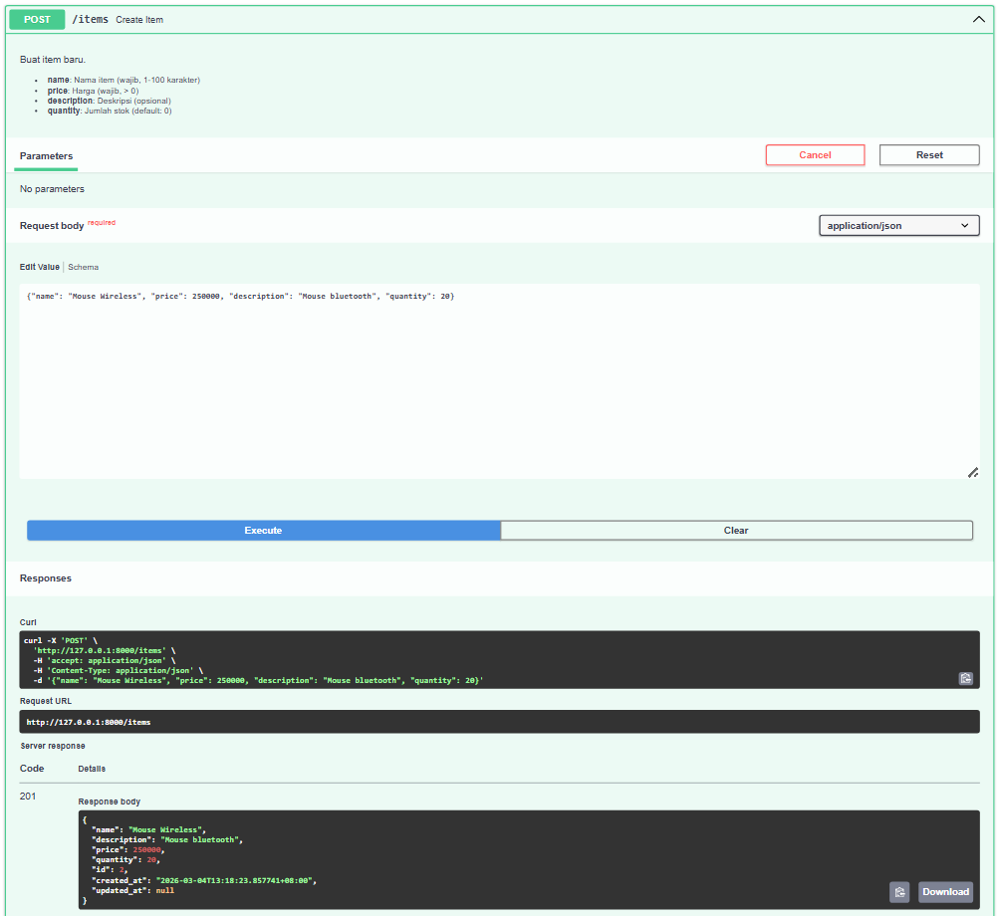
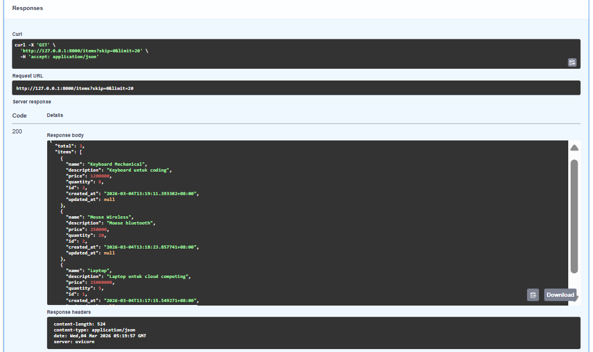
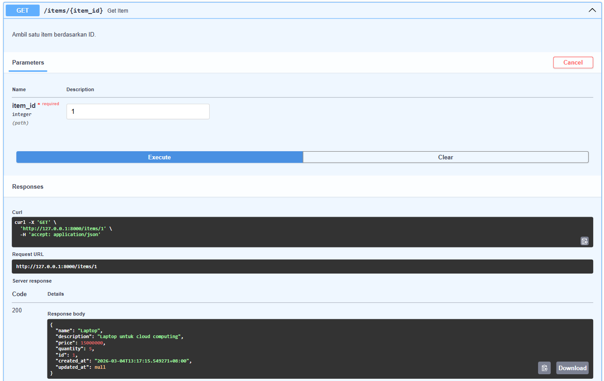
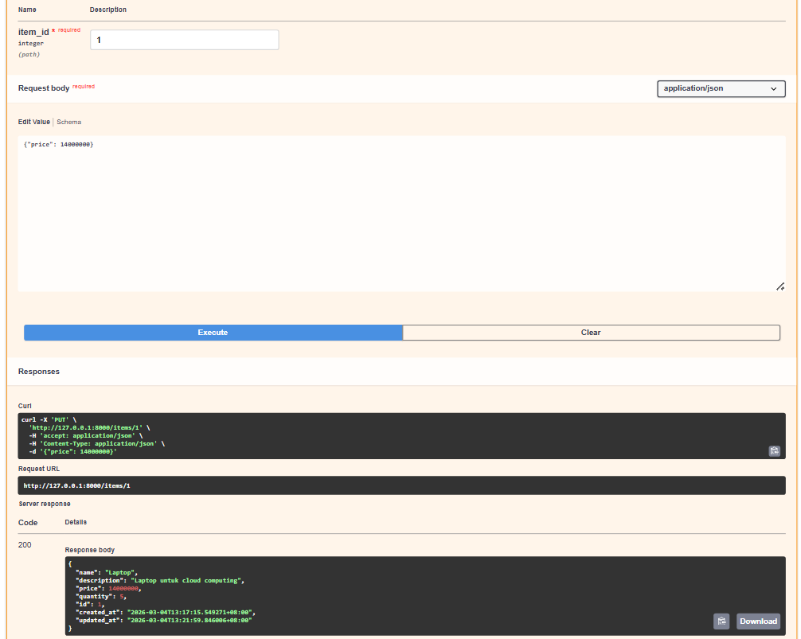
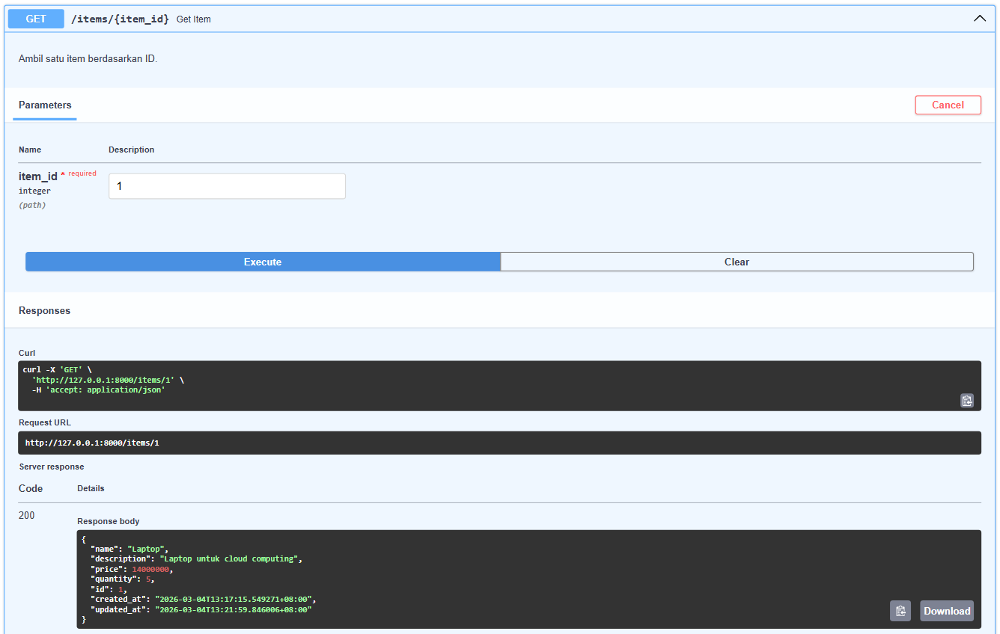
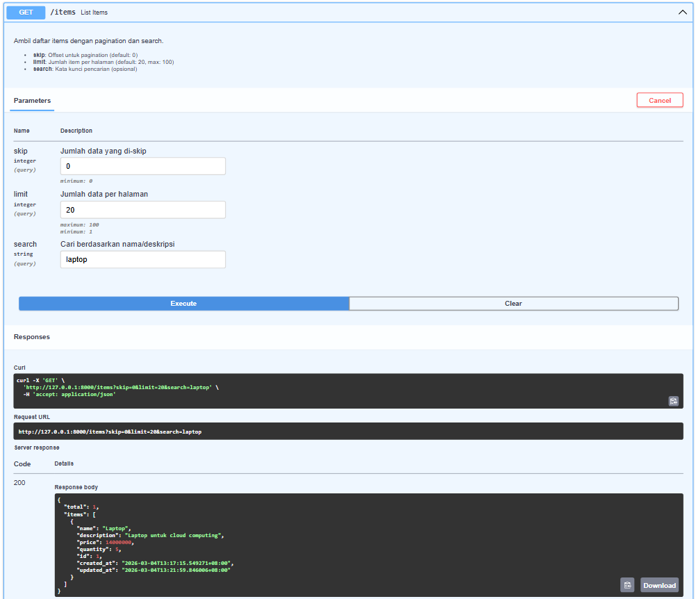
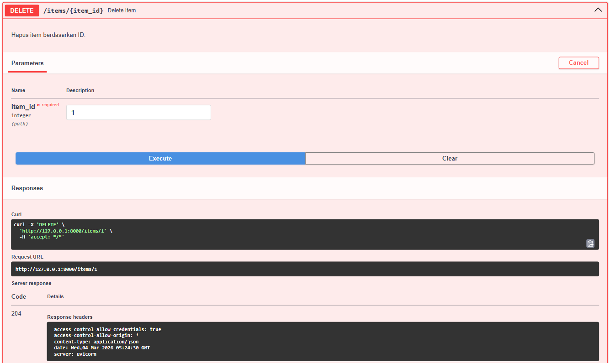
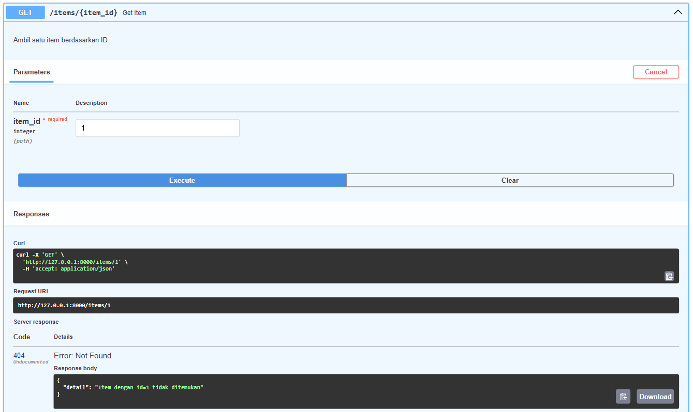

# API Test Results — Taskete 7

---

## Ringkasan Hasil Testing

| No | Endpoint | Method | Status Code | Result |
|----|----------|--------|-------------|--------|
| 1 | `/items` | POST | 201 ✅ | Item berhasil dibuat |
| 2 | `/items` | GET | 200 ✅ | List items dengan pagination |
| 3 | `/items/1` | GET | 200 ✅ | Single item ditemukan |
| 4 | `/items/1` | PUT | 200 ✅ | Item berhasil diupdate |
| 5 | `/items/1` | GET | 200 ✅ | Cek Item berhasil diupdate |
| 6 | `/items?search=laptop` | GET | 200 ✅ | Search berfungsi |
| 7 | `/items/1` | DELETE | 204 ✅ | Item berhasil dihapus |
| 8 | `/items/1` | GET | 404 ✅ | Item tidak ditemukan (expected) |

---

## Detail Testing

#### 1. Create Item (POST /items)

**Items Laptop**

**Items Mouse Wireless**

**Items Keyboard Mechanical**

#### 2. List All Items (GET /items)

#### 3. Get Single Item (GET /items/1)

#### 4. Update Item (PUT /items/1)

#### 5. Check Updated Item (GET /items/1)

#### 6. Search Items (GET /items?search=laptop)

#### 7. Delete Item (DELETE /items/1)

#### 8. Verify Delete — 404 Not Found (GET /items/1)
