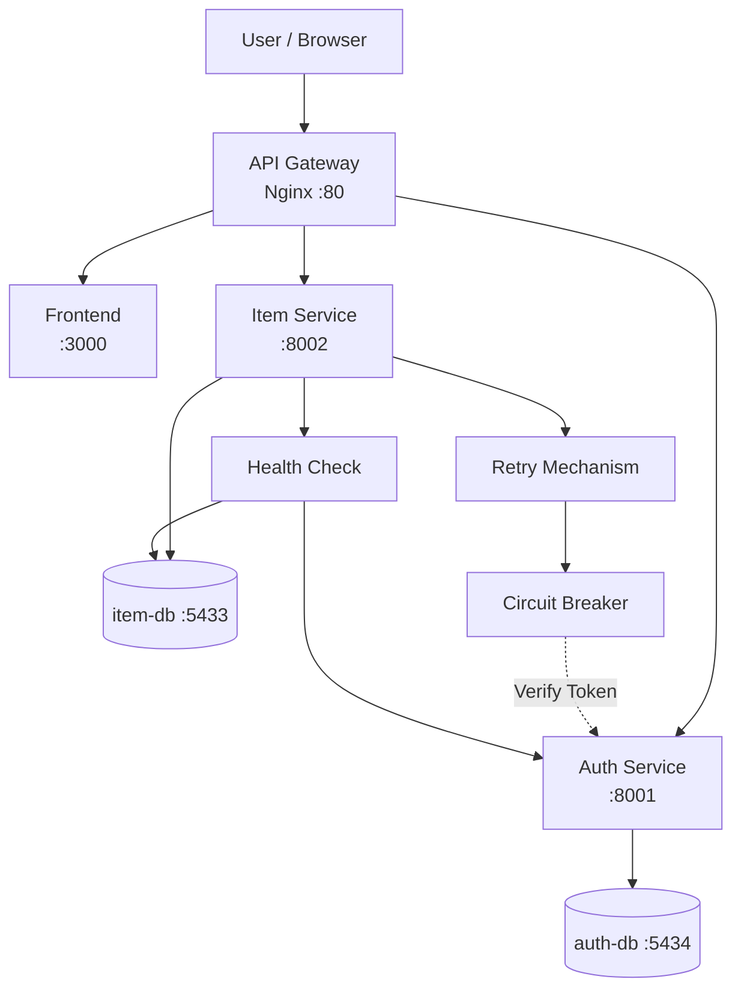

# Microservices Architecture Documentation
Project ini menggunakan arsitektur microservices dengan pemisahan service berdasarkan domain bisnis. Sistem terdiri dari Auth Service untuk autentikasi pengguna, Item Service untuk manajemen item, API Gateway menggunakan Nginx, frontend React, serta database terpisah untuk setiap service.

Komunikasi antar service dilakukan melalui HTTP request dalam Docker network.


## 1. Architecture Diagram


## 2. Services and Ports

| Service | Port | Description |
|---|---|---|
| API Gateway | 80 | Reverse proxy menggunakan Nginx /API Gateaway |
| Frontend | 3000 | React frontend application |
| Auth Service | 8001 | Authentication dan JWT service |
| Item Service | 8002 | CRUD item serta implementasi reliability pattern (Retry, Circuit Breaker, Health Check, dan Graceful Degradation) |
| db | 5432 | PostgreSQL database untuk Backend Service |
| item-db | 5433 | PostgreSQL database untuk Item Service |
| auth-db | 5434 | PostgreSQL database untuk Auth Service |

### Reliability Components (Modul 13)

Modul 13 menambahkan beberapa mekanisme reliability pada Item Service untuk meningkatkan ketahanan sistem ketika terjadi gangguan pada Auth Service.

- Retry Mechanism
  Melakukan percobaan ulang koneksi ke Auth Service menggunakan exponential backoff.

- Circuit Breaker
  Mencegah pengiriman request berulang ke Auth Service ketika service sedang mengalami kegagalan.

- Health Check
  Menampilkan status service dan dependency melalui endpoint `/items/health`.

- Graceful Degradation
  Memungkinkan endpoint publik tetap dapat diakses meskipun Auth Service sedang tidak tersedia.


## 3. API Contract

Auth Service 
Base URL:
```text
http://localhost/auth/register
```

### 3.1 Auth Service

POST /auth/register

Digunakan untuk user baru 
```text
http://localhost:8000/docs#/auth/register
```

#### Request
```
{ 
  "email": "user@example.com",
  "name": "string",
  "password": "string",
}
```

#### Response
```
{
  "id": 0,
  "email": "string",
  "name": "string",
  "role": "string",
}
```

---

POST /auth/login
# Jelaskan

URL :
```text
http://localhost:8000/docs#/Auth/login
```

#### Request

```
{
  "email": "user@example.com",
  "password": "string"
}
```

#### Response

```
{
  "access_token": "string",
  "token_type": "bearer",
}
```

### 3.2 Item Service 
# Jelaskan


POST /items
Digunakan untuk menambahkan item baru.

URL : 

```text
http://localhost:8000/docs#/Items/create_item_items_post
```

#### Request
```
{
  "name": "string",
  "description": "string",
  "price": 0,
  "quantity": 0
}
```

#### Header 
```Authorization: Bearer TOKEN```

#### Response 

```{
  "id": 0,
  "name": "string",
  "description": "string",
  "price": 0,
  "quantity": 0,
  "created_by": 0,
  "created_at": "2026-05-25T11:30:33.295Z",
  "updated_at": "2026-05-25T11:30:33.295Z"
}
```

## 4. Runnning Locally

### 4.1 Build dan Jalankan Semua Service
Jalankan perintah berikut untuk build dan menjalankan seluruh container:
```bash
docker compose up --build -d
```

### 4.2 Cek Status Container 
Menggunakan perintah berikut untuk memastikan semua service berjalan dengan baik:

```bash
docker compose ps
```
Contoh output : 

NAME               SERVICE         STATUS
auth-db            auth-db         running (healthy)
item-db            item-db         running (healthy)
auth-service       auth-service    running
item-service       item-service    running
frontend           frontend        running
gateway            gateway         running

### 4.3 Melihat Logs Semua Service
Untuk melihat log dari seluruh service:
```bash
docker compose logs -f
```

### 4.4 Stop Semua Container
Untuk menghentikan seluruh container:
```bash
docker compose down
```

## 5. Testing Antar Service 

Langkah Pengujian
1. Menjalankan seluruh service dengan Docker Compose
   
```bash
docker compose up --build -d
docker compose ps
```

Hasil : 

NAME                   IMAGE                                STATUS
simcuti-auth-service   cc-kelompok-taskete_7-auth-service   Up (healthy)
simcuti-cuti-service   cc-kelompok-taskete_7-cuti-service   Up (healthy)
simcuti-gateway        nginx:alpine                         Up
simcuti-frontend       cc-kelompok-taskete_7-frontend       Up

2. Register user melalui endpoint /auth/register
```bash
$body = @{
  email = "testbaru@example.com"
  password = "Pass123"
  name = "Test Baru"
} | ConvertTo-Json

Invoke-RestMethod `
  -Method POST `
  -Uri "http://localhost/auth/register" `
  -ContentType "application/json" `
  -Body $body
```

Hasil : 

id email                name
-- -----                ----
1  testbaru@example.com Test Baru

3. Login user melalui endpoint /auth/login

```bash
  $login = @{
  email = "testbaru@example.com"
  password = "Pass123"
} | ConvertTo-Json

$response = Invoke-RestMethod `
  -Method POST `
  -Uri "http://localhost/auth/login" `
  -ContentType "application/json" `
  -Body $login
```

4. Sistem menghasilkan JWT token
```
$response 
```

Hasil : 
```
access_token
------------
eyJhbGciOiJIUzI1NiIsInR5cCI6IkpXVCJ9...
```

5. Token digunakan untuk mengakses endpoint protected /items
   
  ```
$token = $response.access_token

$item = @{
  name = "Laptop Kantor"
  description = "Laptop untuk admin HR"
  price = 12000000
  quantity = 3
} | ConvertTo-Json

Invoke-RestMethod `
  -Method POST `
  -Uri "http://localhost/items" `
  -Headers @{ Authorization = "Bearer $token" } `
  -ContentType "application/json" `
  -Body $item
```

6. Data item berhasil ditambahkan

Hasil : 
```text
id          : 1
name        : Laptop Kantor
description : Laptop untuk admin HR
price       : 12000000.0
quantity    : 3
owner_id    : 1
```
---


### 6. Debbuging

#### 6.1 Melihat log pada `auth-service`

```bash
docker compose logs auth-service
```

Tujuan:  
Digunakan untuk memeriksa proses autentikasi seperti register, login, serta pembuatan JWT token pada service authentication.

---

#### 6.2 Melihat log pada `backend`

```bash
docker compose logs backend
```

Tujuan:  
Digunakan untuk memantau aktivitas backend utama dan memastikan API berjalan tanpa error.

---

#### 6.3 Melihat log pada `item-service`

```bash
docker compose logs item-service
```

Tujuan:  
Digunakan untuk mengecek proses pengelolaan data item seperti penambahan, perubahan, maupun pengambilan data.

---

#### 6.4 Melihat log pada `gateway`

```bash
docker compose logs gateway
```

Tujuan:  
Digunakan untuk memastikan request dari client berhasil diteruskan ke service yang sesuai melalui gateway.

---

#### 6.5 Melihat status seluruh service

```bash
docker compose ps
```

Tujuan:  
Digunakan untuk mengetahui kondisi seluruh container apakah sedang berjalan, healthy, atau mengalami masalah.

## 7. Hasil Testing

## 7. Hasil Testing

Testing berhasil dilakukan dengan hasil:

- Register user berhasil dilakukan melalui endpoint `/auth/register`
- Login user berhasil dilakukan melalui endpoint `/auth/login`
- JWT token berhasil dibuat dan diterima oleh client
- Endpoint protected `/items` berhasil diakses menggunakan token
- Data item berhasil ditambahkan ke database
- Gateway berhasil meneruskan request ke service yang sesuai
- Komunikasi antar service berjalan dengan baik
- Seluruh container berhasil dijalankan tanpa error

### Hasil Pengecekan Container

```text
NAME                   STATUS
simcuti-auth-db        healthy
simcuti-auth-service   healthy
simcuti-backend        healthy
simcuti-cuti-db        healthy
simcuti-cuti-service   healthy
simcuti-db             healthy
simcuti-frontend       running
simcuti-gateway        running
```

## 8. Conclusion

Berdasarkan hasil pengujian yang telah dilakukan, sistem microservices berhasil dijalankan menggunakan Docker Compose dengan komunikasi antar service yang berjalan dengan baik. Proses register, login, pembuatan JWT token, serta akses endpoint protected berhasil dilakukan tanpa kendala. Gateway juga berhasil meneruskan request ke service yang sesuai. Selain itu, seluruh container dapat berjalan dengan status healthy sehingga sistem dapat digunakan sesuai kebutuhan.
