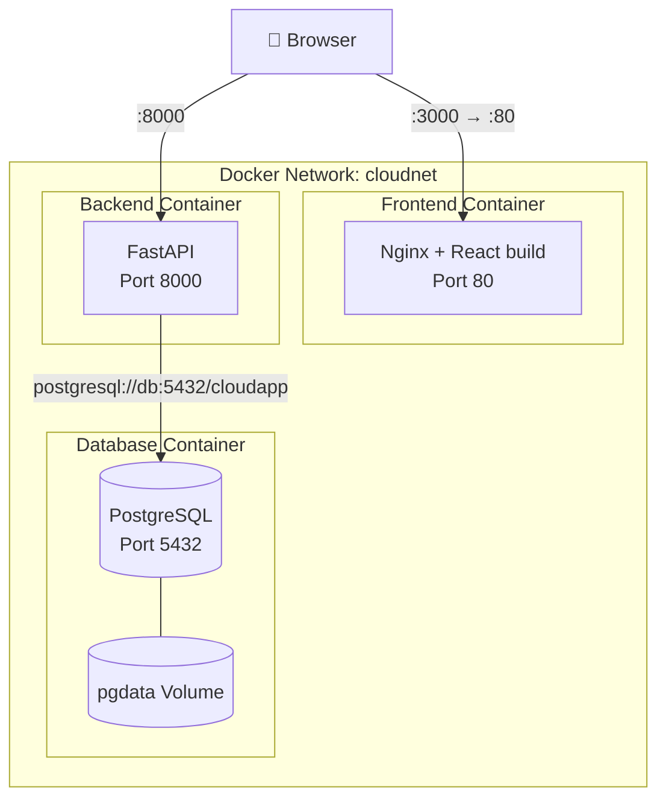

# Modul 6

## Overiew
Aplikasi menggunakan arsitektur berbasis container yang terdiri dari tiga layanan utama yaitu frontend, backend, dan database. Ketiga container tersebut berjalan dalam satu Docker network bernama cloudnet sehingga dapat saling berkomunikasi menggunakan hostname masing-masing container.

## Arsitektur Sistem

## Deskripsi Tiap Container

a. Frontend Container

Frontend menggunakan React yang telah di-build dan dijalankan menggunakan Nginx. Container ini berfungsi untuk menampilkan antarmuka pengguna dan diakses melalui browser.

- Port container: 80
- Port host: 3000
- Teknologi: React + Nginx

b. Backend Container

Backend menggunakan FastAPI yang berfungsi sebagai API untuk mengelola data dan menghubungkan frontend dengan database.

- Port container: 8000
- Port host: 8000
- Teknologi: FastAPI

c. Database Container

Database menggunakan PostgreSQL untuk menyimpan data aplikasi. Container ini menggunakan volume agar data tetap tersimpan meskipun container dihapus.

- Port container: 5432
- Port host: 5433
- Volume: pgdata

## Docker Network

Semua container berada dalam satu network bernama cloudnet. Network ini memungkinkan container saling berkomunikasi menggunakan nama container sebagai hostname. Backend mengakses database menggunakan hostname `db` yang merupakan nama container PostgreSQL di dalam Docker network.

contoh koneksi : 

`postgresql://db:5432/cloudapp`

## Environment Variables
 
### Backend
- DATABASE_URL=postgresql://postgres:postgres123@db:5432/cloudapp
- SECRET_KEY=...

### Database
- POSTGRES_USER=postgres
- POSTGRES_PASSWORD=postgres123
- POSTGRES_DB=cloudapp