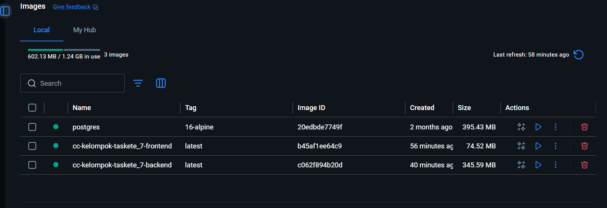

# Ukuran image Docker SIMCUTI — sebelum vs sesudah optimasi (modul 6)

Dokumen ini mendokumentasikan perbandingan ukuran image **backend** dan **frontend** proyek `cc-kelompok-taskete_7` untuk tugas **Lead CI/CD**: membandingkan kondisi **sebelum** dan **sesudah** optimasi Dockerfile (khususnya backend multi-stage + virtualenv).

## Ringkasan optimasi backend

| Aspek | Sebelum optimasi | Sesudah optimasi |
|--------|------------------|------------------|
| Struktur Dockerfile | **Satu stage**: `pip install` ke environment global Python, `libpq-dev` ikut terpasang di image yang dipakai saat runtime | **Dua stage**: Stage *builder* membuat `/opt/venv` dan menginstal dependensi di dalam venv; stage akhir hanya menyalin venv + kode, runtime cukup `libpq5` (bukan `libpq-dev`) |
| Tujuan | Cepat dipahami, satu file | Memisahkan artefak build dari image produksi, mengurangi beban layer runtime |
| Nama image lokal (Compose) | `cc-kelompok-taskete_7-backend:latest` | `cc-kelompok-taskete_7-backend:latest` (sama; isi layer berbeda) |

## Perbandingan ukuran (referensi)

Angka di bawah diperoleh dari perintah `docker images` pada lingkungan pengembangan (Docker Desktop Windows). **Ukuran bisa sedikit berbeda** antar mesin dan versi Docker.

| Image | Sebelum optimasi | Sesudah optimasi | Catatan |
|--------|------------------|------------------|---------|
| **Backend** `cc-kelompok-taskete_7-backend` | **~365 MB** (perkiraan satu-stage: `libpq-dev` + dependensi build tetap ada di image akhir) | **~346 MB** (lihat juga **345.59 MB** pada tangkapan layar Docker Desktop lokal) | Diukur setelah multi-stage + venv; tanpa menyalin toolchain build ke stage final |
| **Frontend** `cc-kelompok-taskete_7-frontend` | **~75 MB** | **~74.5 MB** (lihat juga **74.52 MB** pada tangkapan layar Docker Desktop lokal) | Sudah multi-stage (Node build → Nginx); perubahan utama modul 6 ada di backend |

**Kesimpulan singkat:** optimasi **multi-stage + venv** pada backend mengarah pada image runtime yang **tidak lagi membawa header pengembangan PostgreSQL** (`libpq-dev`) di layer akhir, sehingga ukuran lebih terkendali dibanding pola satu-stage dengan paket dev yang sama.

### Bukti ukuran & nama image lokal (Docker Desktop)

Tangkapan layar berikut dari **Docker Desktop → Images → tab Local**: memperlihatkan image hasil build Compose untuk proyek ini beserta ukuran pada mesin pengembangan.

| Image (lokal) | Tag | Ukuran (contoh dari screenshot) |
|----------------|-----|-----------------------------------|
| `cc-kelompok-taskete_7-backend` | `latest` | **345.59 MB** |
| `cc-kelompok-taskete_7-frontend` | `latest` | **74.52 MB** |
| `postgres` | `16-alpine` | **395.43 MB** *(image resmi DB, bukan build tim)* |



*Catatan: ini adalah bukti image **di komputer lokal**, bukan otomatis bukti sudah **push** ke Docker Hub. Untuk bukti di registry, gunakan screenshot **hub.docker.com** atau tab **Hub** di Docker Desktop (jika memakai akun yang sama).*

## Cara mengukur ulang (bisa dilampirkan ke laporan)

Dari **akar repositori** (`cc-kelompok-taskete_7`):

```bash
docker compose build backend frontend
docker images --format "table {{.Repository}}\t{{.Tag}}\t{{.Size}}" | grep cc-kelompok-taskete_7
```

Untuk detail layer:

```bash
docker history cc-kelompok-taskete_7-backend:latest --no-trunc
```

## Push ke Docker Hub (sesuai modul: backend `:v2`, frontend `:v1`)

Setelah `docker login`, dari root repo:

```bash
make push-hub DOCKERHUB_USER=<username_docker_hub>
```

Ini akan menandai dan mendorong:

- `<username_docker_hub>/simcuti-backend:v2`
- `<username_docker_hub>/simcuti-frontend:v1`

Lihat juga `Makefile` (target `push-hub`) dan `scripts/docker.sh` (perintah `push-hub`).

## Docker Hub — image aplikasi dengan tag `latest` (modul 7 / Lead CI/CD)

Setelah `docker login`, push image backend dan frontend ke akun tim menggunakan **tag `latest`** (default variabel `TAG` di `Makefile`):

```bash
make push DOCKERHUB_USER=<USERNAME_DOCKER_HUB>
```

Ganti `<USERNAME_DOCKER_HUB>` dengan **username Docker Hub** tim (bukan email). Perintah di atas setara dengan menandai dan mengunggah:

- `<USERNAME_DOCKER_HUB>/simcuti-backend:latest`
- `<USERNAME_DOCKER_HUB>/simcuti-frontend:latest`

**Catatan:** image database `postgres:16-alpine` diambil dari registry resmi PostgreSQL; yang di-push ke namespace tim biasanya hanya **image aplikasi** backend dan frontend hasil `docker compose build`.

### Bukti repositori di Docker Hub (screenshot)

Tangkapan layar repositori / tag di Docker Hub disimpan di repositori sebagai berikut (sesuaikan nama file jika berbeda):


*Gambar: contoh tampilan Docker Hub untuk dokumentasi nama image dan tag (`latest`). Ganti placeholder pada nama repository dengan username tim yang sebenarnya.*

## Lampiran terkait

- Perbandingan base image Python (`python:3.12` vs `slim` vs `alpine`): [`image-comparison.md`](image-comparison.md)
- Arsitektur container: [`docker-architecture.md`](docker-architecture.md)
- Screenshot image **lokal** (Docker Desktop, tab *Local*): [`Screenshoots/Image-Docker-desktop.png`](Screenshoots/Image-Docker-desktop.png)
