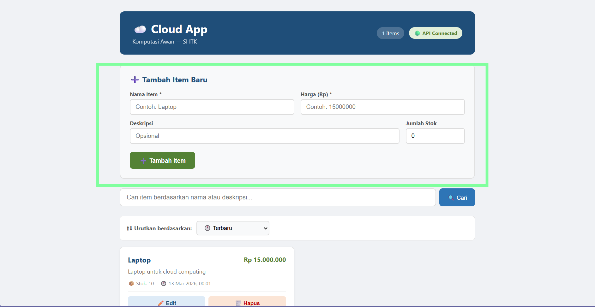

## UI Test Result

### 1. Cek Status API ✅


Saat aplikasi dibuka di ```localhost:5173``` indikator status API menunjukkan Connected. Hasil pengujian menandakan bahwa  frontend berhasil terhubung dengan backend dan tidak terjadi error pada koneksi API.

### 2. Items dari Modul 2 muncul di daftar ✅
   


Hasil testing menunjukkan daftar item yang berasal dari database sebelumnya berhasil ditampilkan pada halaman aplikasi. 

### 3. Menambahkan item baru via form ✅
   


Pengujian dilakukan dengan mengisi form penambahan item dan menekan tombol tambah item. Sistem berhasil memproses data yang dimasukkan tanpa error.

### 4. Item muncul pada daftar ✅


Setelah menambahkan item, item yang baru ditambahkan muncul pada daftar item di halaman aplikasi. Hal ini menunjukkan bahwa data berhasil tersimpan dan ditampilkan pada sistem.


### 5. Melakukan klik edit pada Item ✅


Menekan tombol edit pada salah satu item dipilih dan berhasil terbuka.

### 6. Form berisi data lama, Mengubah harga & klik update ✅
   


Hasil pengujian menunjukkan Form edit terbuka dan berisi data lama. Selanjutnya dilakukan dengan mengubah harga dan klik tombol update berhasil.


Hasil testing menunjukkan perubahan mengubah harga yang sudah dilakukan berhasil tersimpan dan data pada daftar item terperbarui.


### 7. Mencari Item via searchbar ✅


Ketika melakukan pencarian melalui SearchBar, item yang sesuai dengan kata kunci berhasil ditampilkan pada daftar item. Hasil pencarian muncul dengan benar sesuai data yang dicari.

### 8. Menghapus item & Confirm Dialog Muncul ✅


Saat tombol Hapus dipilih, hasil pengujian menunjukkan sistem menampilkan dialog konfirmasi sebelum item dihapus. 

### 9. Item akan hilang dari daftar ✅


Setelah penghapusan dikonfirmasi, item yang dipilih berhasil dihapus dari daftar dan tidak lagi muncul pada halaman aplikasi.

### 10. Menghapus semua, dan muncul Empty State  ✅


Setelah seluruh item pada daftar dihapus, halaman aplikasi menampilkan tampilan empty state yang menunjukkan bahwa tidak ada item yang tersedia di daftar. 