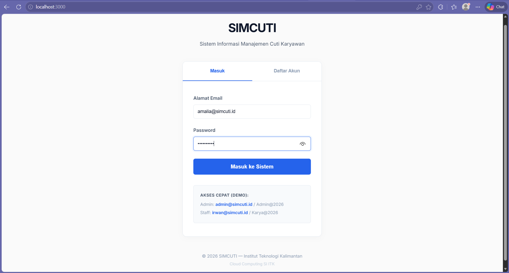
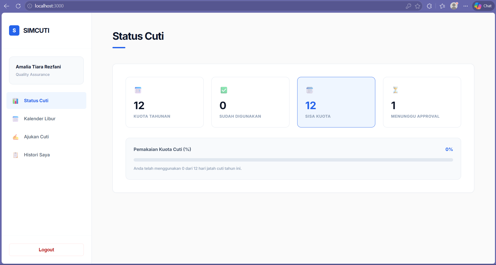
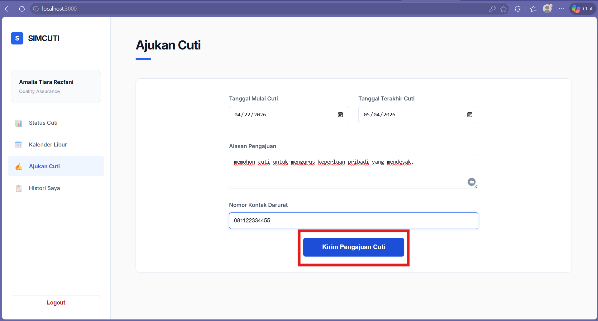
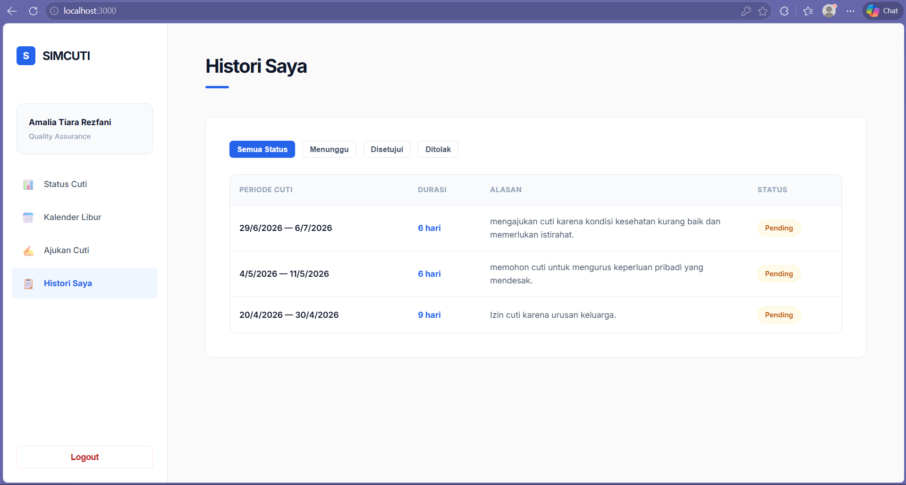
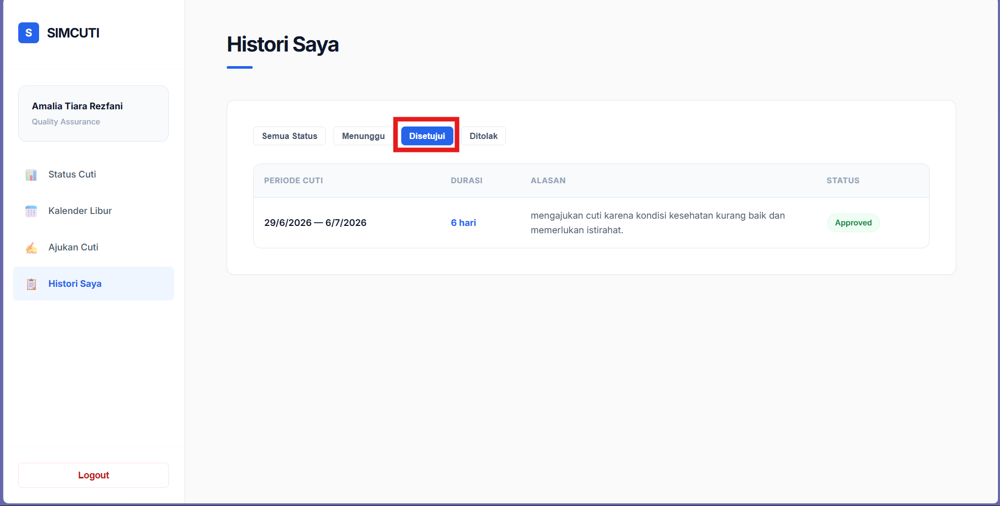

## UI Test Result

| Kode Testing | Skenario Pengujian        | Langkah Pengujian                          | Hasil yang Diharapkan              | Status | Bukti |
|--------------|--------------------------|--------------------------------------------|------------------------------------|--------|-------|
| TC-01        | Login berhasil           | Input username & password valid            | Berhasil masuk ke dashboard        | ✅     |  |
| TC-02        | Melakukan login terlebih dahulu | Masuk ke halaman dashboard SIMCUTI       | Tampilan dashboard                 | ✅     |  |
| TC-03        | Create items pengajuan cuti | Kirim Pengajuan Cuti             | Muncul notifikasi pengajuan cuti berhasi      | ✅ | | 
| TC-04        | Melihat data pengajuan cuti yang sudah berhasil dibuat | Kirim Pengajuan Cuti             | Masuk ke halaman histori dan terdapat items yang sudah dibuat      | ✅ | | 
| TC-04        | Melihat data pengajuan cuti yang apakah approved atau ditolak | Masuk ke dalam histori saya             | Masuk ke halaman histori dan terdapat items yang sudah dibuat      | ✅ | | 

